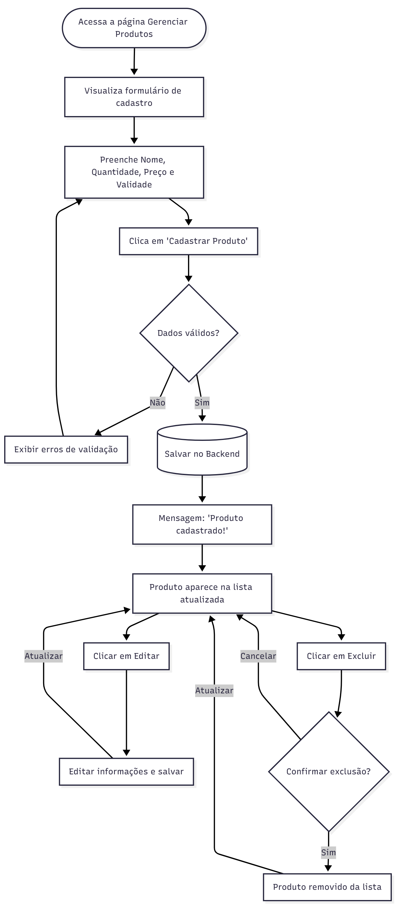
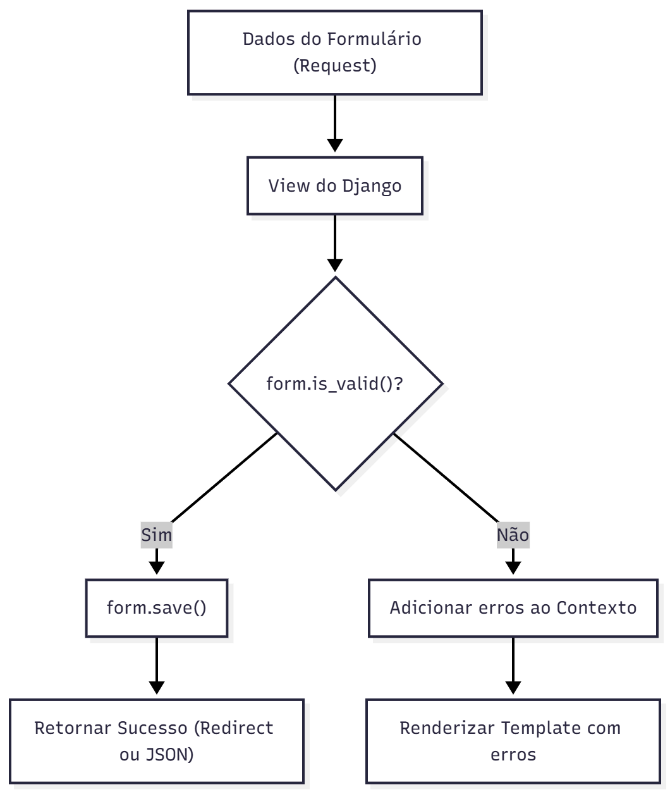

# django-produto

> Um sistema simples com Django para gerenciar produtos — cadastro, listagem, (evolutivamente) CRUD completo.  

## 🧾 Visão geral  
Este projeto é uma base de exemplo (ou ponto de partida) de um sistema backend — com frontend minimalista — para cadastro e listagem de produtos, usando o framework Django.  
Pode servir como estudo, base para extensões futuras ou protótipo rápido para aplicações de estoque/loja.  

## ✅ Funcionalidades  
- Listar produtos cadastrados.  
- Criar novos produtos.  
- Estrutura básica de backend + frontend integrada.  
- Configuração via virtual environment + requirements.txt.  

## 📚 Tecnologias & Dependências  
- Python 3.x  
- Django (versão usada no projeto)  
- Bibliotecas definidas em `requirements.txt`  
- React no frontend — confira a pasta `frontend`

-----

## 📷 Demonstração


## 🚀 Como usar / rodar localmente  

```bash
# Clone este repositório  
git clone https://github.com/leonard0antonio/django-produto-main.git  

# Acesse a pasta do projeto  
cd django-produto-main  

# Crie e ative um ambiente virtual  
python -m venv .venv  
# no Windows:
.venv\Scripts\activate  
# no Linux / macOS:
source .venv/bin/activate  

# Instale as dependências  
pip install -r requirements.txt  

# Aplique as migrações  
python manage.py migrate  

# (Opcional) Crie um superusuário para acessar o admin  
python manage.py createsuperuser  

# Execute o servidor de desenvolvimento  
python manage.py runserver  

# Acesse via browser:
http://127.0.0.1:8000/  
````

## 🎯 Estrutura de pastas principais

```
/config         – configuração do projeto Django  
/frontend       – código frontend (se houver)  
/produtos       – app Django que contém o model Produto, views, templates, etc.  
manage.py      – script de gerenciamento do Django  
requirements.txt – dependências do projeto  
```

## 🔄 Fluxos do Sistema




-----
### 🔁 **DataFlow — Fluxo de Dados



-----

## 🤝 Como contribuir

Contribuições são bem-vindas! Se quiser sugerir melhorias ou novas funcionalidades:

1. Fork o repositório.
2. Crie uma branch para sua feature (`git checkout -b feature/nome-da-feature`).
3. Faça commits das suas alterações (`git commit -m 'Adiciona ...'`).
4. Envie um pull request.

## 📞 Contato

Se quiser entrar em contato comigo: leonard0antonio (você pode colocar seu e-mail ou perfil GitHub).

```
-

